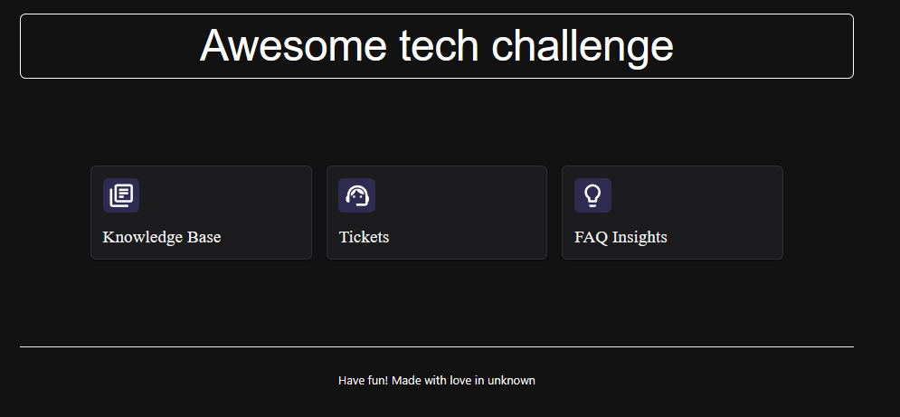
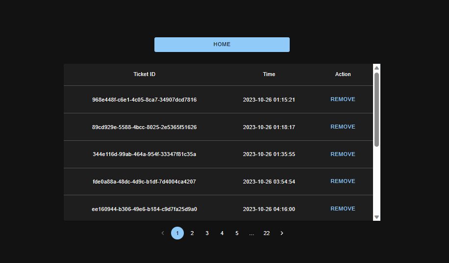
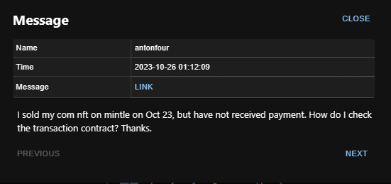

# Awesome Ticket Challenge - Implementation Details

## Overview

In this challenge, I implemented a solution to manage Discord tickets for moderators. The key features include viewing unanswered tickets, accessing message links, and removing tickets. The backend is built with FastAPI, and the frontend utilizes React with TypeScript.

## Backend

### FastAPI

Application

-   Implemented a FastAPI application to serve ticket data from a JSON file.
-   Configured CORS to allow requests from the frontend application.

### TicketRepository Class

-   Added functionality to filter tickets based on their "open" status.
-   Implemented caching for message data to optimize response times for repeated requests.

### Endpoints

-   `/tickets`: Returns a list of tickets, filtering out removed tickets and only including those with an "open" status.
-   `/tickets/{ticket_id}/context`: Retrieves context messages for a specific ticket.
-   `/tickets/{ticket_id}/context/{message_id}`: Retrieves a specific context message, using caching to optimize repeated requests.
-   `/tickets/{ticket_id}/remove`: Allows moderators to remove tickets. Removed tickets are stored in memory and are excluded from future queries.

### Data Handling

-   Added `removed_ticket_ids` set to track IDs of removed tickets, ensuring they do not appear in subsequent ticket queries.
-   The `get_tickets` method was specifically updated to filter for tickets with an "open" status as this directly aligns with the challenge requirement to enable moderators to easily find and see the questions they haven't answered yet.

## Frontend

### React with TypeScript

-   Developed a React application using TypeScript for type safety and improved code reliability.
-   Implemented a user-friendly interface allowing moderators to interact effectively with the ticket data.

### Home Page Buttons

-   Created three buttons on the home page (`/home`) as per design requirements.
-   The "Tickets" button redirects the user to the tickets page (`/tickets`).
-   The button layouts are defined in `components/buttonLayout/`.
-   Custom buttons (`components/knowledgeBaseButton`, `components/fAQInsightsButton`, and `components/ticketsButton`) were created for each specific functionality.

### Tickets Page (`/tickets`)

-   The Tickets page displays a table of tickets with columns for ticket ID, time, and action.
-   Implemented functionality to view tickets in order of oldest to newest that haven't been answered yet.
-   The action column allows moderators to remove tickets deemed unworthy of response.
-   A modal is used to show message details when a ticket row is clicked. It displays the message's name, time, link, and content.
-   Pagination is implemented for easy navigation through ticket lists.

### Navigation

-   A "Home" button is available on the Tickets page to allow easy navigation back to the home page.
-   The UI is designed to be intuitive and aligns with the provided design specifications.

### Message Details Modal

-   On clicking a ticket, a modal displays the message details including the author's name, time of the message, a link to the original Discord message, and the message content.
-   The modal provides options to navigate through different messages associated with the ticket.

## Conclusion

The implementation of the Awesome Ticket Challenge addresses the core needs of moderators managing Discord tickets. The solution streamlines the workflow for moderators, allowing them to efficiently identify and address unanswered questions. The combination of a robust FastAPI backend and a reactive TypeScript-based frontend provides a seamless user experience. The frontend design is intuitive, aligning with the provided Figma design specifications. The ability to view, manage, and remove tickets, as well as access message details directly from the interface, enhances the efficiency of the moderation process. This project successfully meets the objectives of the challenge, demonstrating a full-stack solution for managing Discord tickets.